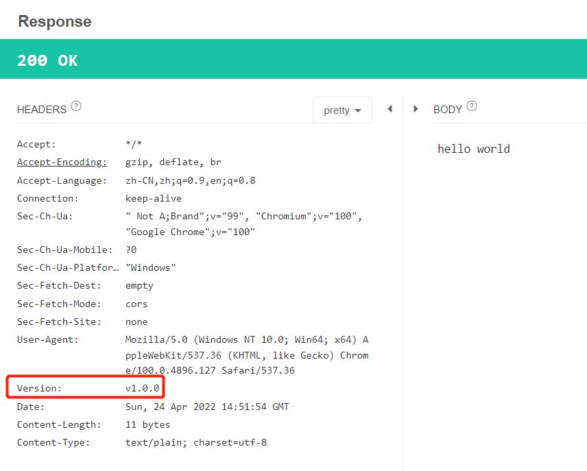

## 模块2 编写GO程序
1. 线程加锁
2. 线程调度
3. go语言内存管理
4. 包引用与依赖关系，makefile项目编译: go mod, target
5. 编写一个HTTP Server: http handler
6. go语言调试：glog, klog
7. Kubernetes中如何使用go语言：案例分析

## 模块2 作业
> 编写一个 HTTP 服务器，大家视个人不同情况决定完成到哪个环节，但尽量把 1 都做完：

1. 接收客户端 request，并将 request 中带的 header 写入 response header
2. 读取当前系统的环境变量中的 VERSION 配置，并写入 response header
3. Server 端记录访问日志包括客户端 IP，HTTP 返回码，输出到 server 端的标准输出
4. 当访问 localhost/healthz 时，应返回 200

### Console运行结果，如下
```
GOROOT=C:\Program Files\Go #gosetup
GOPATH=D:\Repository\git\go #gosetup
"C:\Program Files\Go\bin\go.exe" build -o C:\Users\user\AppData\Local\Temp\GoLand\___go_build_main_go.exe D:\Repository\git\go\src\github.com\cncamp3\module2\main.go #gosetup
C:\Users\user\AppData\Local\Temp\GoLand\___go_build_main_go.exe
2022/04/24 22:51:49 [INFO] receive request from: 127.0.0.1, method: GET, url: /healthz
2022/04/24 22:51:54 [INFO] receive request from: 127.0.0.1, method: GET, url: /
```

### API Tester工具结果，如下

